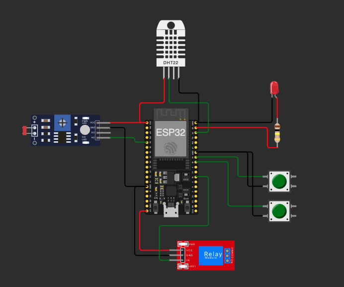

# FIAP - Faculdade de Informática e Administração Paulista

<p align="center">
<a href= "https://www.fiap.com.br/"></a>
</p>

<br>

# Sistema de Irrigação Inteligente - FarmTech Solutions

## 🔗 Link do Projeto
[Simulação no Wokwi](https://wokwi.com/projects/414593759570745345)

## 👨‍🎓 Integrantes: 
- <a href="https://www.linkedin.com/in/gabemule/">Gabriel Mule Monteiro</a>

## 👩‍🏫 Professores:
### Tutor(a) 
- <a href="https://www.linkedin.com/company/inova-fusca">Lucas Gomes Moreira</a>

## 📜 Descrição

Este projeto é parte da Fase 3 do sistema de gestão agrícola da empresa FarmTech Solutions, focando na implementação de um sistema de irrigação inteligente que integra sensores físicos a uma plataforma digital.

O sistema realiza o monitoramento em tempo real das seguintes variáveis:
- Níveis de nutriente Fósforo (P) - simulado por botão
- Níveis de nutriente Potássio (K) - simulado por botão
- pH do solo - simulado por sensor LDR
- Umidade - utilizando sensor DHT22

O sistema automaticamente controla a irrigação (representada por um relé) baseado nas leituras dos sensores, garantindo condições ideais para o cultivo.

### Parâmetros de Irrigação

O sistema utiliza os seguintes parâmetros para controle da irrigação:

1. Condições de Umidade:
   - Mínima: 30% (evita solo muito seco)
   - Máxima: 80% (evita encharcamento)
   - Justificativa: Esta faixa mantém o solo úmido o suficiente para absorção de nutrientes sem risco de apodrecimento das raízes

2. Condições de Temperatura:
   - Mínima: 10°C (evita irrigação em temperaturas muito baixas)
   - Máxima: 50°C (evita evaporação excessiva)
   - Justificativa: Irrigação nesta faixa de temperatura otimiza a absorção de água e nutrientes

3. Condições de pH (simulado pelo sensor LDR):
   - Faixa de leitura: 0-700 na escala do LDR
   - Justificativa: Embora seja uma simulação, representa a faixa de pH do solo onde a maioria das culturas se desenvolve bem

4. Nutrientes (simulados por botões):
   - Fósforo (P): Botão deve estar pressionado indicando presença
   - Potássio (K): Botão deve estar pressionado indicando presença
   - Justificativa: Simula a necessidade de presença mínima destes nutrientes para efetiva absorção da água

### Lógica de Ativação da Irrigação

O sistema ativa a irrigação (relé) APENAS quando TODAS as seguintes condições são atendidas:

1. Condições Ambientais:
   - Umidade está entre 30% e 80%
   - Temperatura está entre 10°C e 50°C
   - Leitura do LDR (pH simulado) está entre 0 e 700

2. Condições de Nutrientes:
   - Pelo menos um dos botões (P ou K) está pressionado
   - Justificativa: Indica presença mínima de nutrientes necessários

Esta lógica foi implementada para:
- Evitar desperdício de água
- Garantir condições ótimas de absorção
- Prevenir danos às culturas
- Otimizar o uso de recursos

## 📁 Estrutura de pastas

- <b>src</b>: Código-fonte do projeto
  - <b>main.cpp</b>: Implementação do sistema no ESP32
  - <b>database.py</b>: Código Python para operações CRUD no banco de dados

- <b>include</b>: Arquivos de cabeçalho

- <b>lib</b>: Bibliotecas do projeto

- <b>docs</b>: Documentação adicional

- <b>test</b>: Arquivos de teste

## 🔧 Instalação e Configuração

### Pré-requisitos

1. VSCode com extensão PlatformIO
2. Python 3.8+
3. Oracle Instant Client 23.3
4. Conta no Wokwi.com

### 🚀 Getting Started

1. **Clone o Repositório**
   ```bash
   git clone [url-do-repositorio]
   cd [nome-do-projeto]
   ```

2. **Instale o Oracle Instant Client**
   - Baixe o Oracle Instant Client 23.3 Basic Package para seu sistema:
     - [Download Oracle Instant Client](https://www.oracle.com/database/technologies/instant-client/downloads.html)
   - Extraia para sua pasta Downloads:
     ```bash
     cd ~/Downloads
     unzip instantclient-basic-macos.zip  # ou seu arquivo correspondente
     ```

3. **Configure o Ambiente Python**
   ```bash
   # Crie e ative o ambiente virtual
   python -m venv venv
   source venv/bin/activate  # No Windows: .\venv\Scripts\activate
   
   # Instale as dependências
   pip install -r requirements.txt
   ```

4. **Configure o Arquivo .env**
   ```env
   # Configurações do banco de dados Oracle
   DB_USER=seu_user
   DB_PASSWORD=sua_senha
   DB_DSN=oracle.fiap.com.br:1521/ORCL
   ORACLE_HOME=/Users/$USER/Downloads/instantclient_23_3
   ```

5. **Teste a Instalação**
   ```bash
   # Configure variáveis de ambiente
   export ORACLE_HOME=/Users/$USER/Downloads/instantclient_23_3
   export DYLD_LIBRARY_PATH=$ORACLE_HOME
   
   # Teste o Oracle Client
   python -c "import cx_Oracle; print(cx_Oracle.clientversion())"
   ```

### Hardware Simulado (Wokwi)

- ESP32 DevKit
- Sensor DHT22 (umidade)
- Sensor LDR (simulando pH)
- 2x Botões push (simulando sensores P e K)
- LED
- Módulo Relé (sistema de irrigação)

### Conexões do Hardware

<p align="center">

</p>

Conexões dos componentes ao ESP32:
- DHT22 → Pino 22
- LDR → Pino 34 (Entrada Analógica)
- Botão P → Pino 18
- Botão K → Pino 19
- LED → Pino 23
- Relé → Pino 16

## 💻 Execução do Projeto

### ESP32 (Wokwi)

1. Acesse o [projeto no Wokwi](https://wokwi.com/projects/414593759570745345)
2. Clique em "Start" para iniciar a simulação
3. Interaja com os botões e observe as leituras dos sensores

### Sistema de Banco de Dados

1. Execute o script Python para operações CRUD:
   ```bash
   ORACLE_HOME=/Users/$USER/Downloads/instantclient_23_3 DYLD_LIBRARY_PATH=/Users/$USER/Downloads/instantclient_23_3 python src/database.py
   ```

2. Menu de Operações:
   - 1: Criar - Inserir dados aleatórios
   - 2: Ler - Mostrar todos os registros
   - 3: Atualizar - Modificar um registro
   - 4: Deletar - Remover um registro
   - 5: Deletar - Remover todos os registros
   - 6: Sair

### Formato dos Dados (JSON)

O sistema envia dados pela porta serial no formato:
```json
{
  "sensors": {
    "humidity": [valor],
    "temperature": [valor],
    "light": [valor]
  },
  "buttons": {
    "btnP": [true/false],
    "btnK": [true/false]
  },
  "validation": {
    "sensorsValid": [true/false],
    "buttonActive": [true/false]
  }
}
```

## 📺 Demonstração

[PLACEHOLDER: Adicionar link do vídeo demonstrativo no YouTube]

## 🗃 Histórico de lançamentos

* 0.1.0 - 25/03/2024
    * Implementação inicial do sistema de irrigação inteligente
    * Monitoramento de sensores simulados (P, K, pH, umidade)
    * Sistema de validação de condições
    * Integração com banco de dados (operações CRUD)
    * Saída formatada em JSON

## 📋 Licença

<p xmlns:cc="http://creativecommons.org/ns#" xmlns:dct="http://purl.org/dc/terms/">MODELO GIT FIAP por <a rel="cc:attributionURL dct:creator" property="cc:attributionName" href="https://fiap.com.br">Fiap</a> está licenciado sobre <a href="http://creativecommons.org/licenses/by/4.0/?ref=chooser-v1" target="_blank" rel="license noopener noreferrer" style="display:inline-block;">Attribution 4.0 International</a>.</p>
